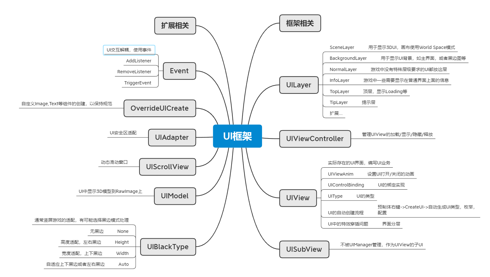
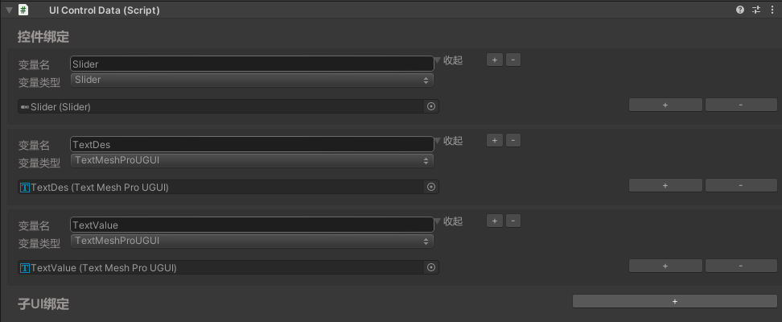

# UISystem
通用UGUI系统

# 前言
我自从接触游戏开发后，做过的最多功能就是UI，我相信大多数游戏客户端也是一样的，大家对做UI这件事肯定也不比我陌生，我这里简单介绍一下在UI框架中需要实现的东西

# UGUI画布Canvas
文档：[Unity官方文档](https://docs.unity3d.com/cn/current/Manual/class-Canvas.html)
三种类型：
* Screen Space - Overlay：即使场景没有相机，也可以渲染UI，UI会显示在最上层，画布会进行缩放来适应屏幕
* Screen Space - Camera：渲染在相机上，相机上的3D/2D物体可以显示在UI前面，如果UI中需要加载模型等显示就可以使用这种，画布始终保持一定比例在相机上，不会受距离影响
* World Space：渲染在世界空间，画布会受相机距离影响
比较重要的一些属性：SortingLayer， Order In Layer都是用于控制渲染顺序的：SortingLayer越大显示在越上层，同SortingLayer下Order In Layer越大显示在越上层，同Order In Layer下距离相机越近渲染在越上层。

## 画布适配Canvas Scaler
三种类型：
* Constant Pixel Size：按原像素大小渲染，不会因为屏幕分辨率大小变化而变化，可以通过设置Scale Factor来调整UI的大小
* Scale With Screen Size：根据给定的大小，适应屏幕分辨率，屏幕越大UI越大，可设置Screen Match Mode来改变适配策略：
    1. Match Width Or Height：适配宽或者高，适配宽度(0)时在超宽屏中长度不足，适配高度(1)时在超窄屏中宽度不足，将匹配值设置到0.5时可以解决大多数适配问题，但依旧会有一边存在显示不全的问题(如UI做的时候以高度1334做的，遇到超宽屏时宽度高度同时适配50%大小，适配调整后UI画布高度不足1334)，因此也不建议使用这种方式。
    2. Expand：画布大小不会小于预设值，只会从这个大小往变大缩放，这种可以保证UI一定可以被显示完全，UI中只会拉大缝隙，但不会有显示不全的情况，不过前提时锚点要设置到位。
    3. Shrink：与Expand相反，画布大小不会大于预设值
* Constant Physical Size：无论屏幕大小和分辨率如何，UI 元素都保持相同的物理大小，这种方式目前我并没有使用过，具体用途未知。
从个人主观意识上来看：使用Scale With Screen Size + Expand可以解决大多数适配问题，但是又有一个前提是锚点一定要设置到位。

## 黑边方式适配
有些游戏美术并不喜欢拉大UI的缝隙来达到UI适配的效果，他们想要UI与他们的预设图保持一致，这种时候为了适配所有不同分辨率就会采用黑边的方式来适配。
这种方式也存在几种效果：在保证高度适配的前提下左右黑边，以及在宽度适配的前提下上下黑边，通常黑边效果需要通过分辨率动态调整，在超长屏中上下黑边，在超宽屏中使用左右黑边的方式来尽可能的减少黑边，判断方式也很简单，只需要判断分辨率的高和宽哪个与预设值相差的大，那么就使用哪种黑边方式，这都由具体游戏效果决定。
这种适配方式还有一个好处是锚点不需要设置了，锚点可以全部居中，因为黑边后显示的画布实际分辨率会与我们的预设分辨率达到一致，因此锚点就不存在作用了。当然如果不采用动态调整黑边方向的方式，而是只保持左右黑边或者上下黑边一种，那么还是需要设置垂直或者水平一方的锚点。不过个人认为黑边这种效果并不是很好，通常只能用于竖屏游戏。

## 安全区适配
为了适配市面上奇形怪状的手机屏，说一下关键的做法，拿到设备安全区和朝向后，修改UI的锚点达到效果。
```
var safeArea = Screen.safeArea;         //当前设备的安全区
var orientation = Screen.orientation;   //当前设备朝向
RectTransform rectTransform = transform as RectTransform;
rectTransform.sizeDelta = Vector2.zero;
// 1. 上下左右全适配
rectTransform.anchorMin = new Vector2(safeArea.xMin / Screen.width , safeArea.yMin / Screen.height);
rectTransform.anchorMax = new Vector2(safeArea.xMax / Screen.width , safeArea.yMax / Screen.height);
// 2. 通常适配安全区不会适配底部，只会适配头部：如下
if (orientation == ScreenOrientation.LandscapeLeft)
{
    rectTransform.anchorMin = new Vector2(safeArea.xMin / Screen.width, 0);
    rectTransform.anchorMax = new Vector2(1, 1);
}
else if(orientation == ScreenOrientation.LandscapeRight)
{
    rectTransform.anchorMin = new Vector2(0, 0);
    rectTransform.anchorMax = new Vector2(safeArea.xMax / Screen.width, 1);
}
else if(orientation == ScreenOrientation.Portrait)
{
    rectTransform.anchorMin = new Vector2(0, 0);
    rectTransform.anchorMax = new Vector2(1, safeArea.yMax / Screen.height);
}
else if(orientation == ScreenOrientation.PortraitUpsideDown)
{
    rectTransform.anchorMin = new Vector2(0, safeArea.yMin / Screen.height);
    rectTransform.anchorMax = new Vector2(1, 1);
}
```

# UI框架
上面我们基本介绍了UGUI中画布的使用以及适配等效果的区别和使用场景，下面我们开始制作UI框架，首先需要理清基本需求：支持UI的开关，UI的覆盖与被覆盖，支持血条等3DUI的显示，支持在UI上显示3D模型，UI上显示特效，支持黑边适配，界面下的子UI，循环滑动窗口，UI的绑定，UI自动化流程等等。我们来一个个解决这些问题，最终目的是为了最大程度上减少重复开发量，最大程度上简单并可解决绝大多数的游戏UI需求。


## UILayer分层
UI由业务会分为很多层，如显示3DUI的层，显示主界面的层，显示Loading界面，显示跑马灯等提示的层级，合理的分层可以避免很多异常情况，如跑马灯或者Toast提示时，我点开了一个新界面，依旧能看到跑马灯和Toast在最上层，根据游戏需求我将UI分为如下几层，当然可以看情况扩展嘛：
* SceneLayer：用于显示3DUI，画布使用World Space模式
* BackgroundLayer：用于显示UI背景，如主界面，或者黑边图等。
* NormalLayer：游戏中没有特殊层级要求的UI都放这层
* InfoLayer：游戏中一些需要显示在普通界面上面的信息
* TopLayer：顶层，显示Loading等
* TipLayer：提示层，看情况设计，有时Loading中也需要弹出提示框等信息
关于如何控制层级渲染顺序，SortingLayer和Order in Layer都可以，我个人喜欢所有顺序直接使用Order In Layer来管理。

### UILayer的功能
1. 每个界面之间可能会有特效等，为了特效不在界面中穿插，因此每个界面都需要单独设置Order In Layer并且两个界面之间需要预留一定的空间，用来避免特效在界面中的穿插问题，这算是我见过比较常规的做法，但是这种做法还是比较麻烦，最好的方式是使用继承MaskableGraphic实现UI层面的粒子特效，推荐[UI Particle Image](https://assetstore.unity.com/packages/tools/gui/ui-particle-image-235001)插件，实现了UI粒子特效，就不用在意其在UI中穿插的问题，这看项目通常项目的特效不了解这个因此还是会使用常规粒子特效做法，因此我们每个Layer中还是需要管理这个渲染层级。
2. 在项目后期优化时发现，当我一个打开多个界面时，UI上会同时叠了好几个界面，底下看不见的界面同样被渲染造成大量DrawCall，因此需要管理UI的覆盖关系，如果发现UI被覆盖时需要把UI先隐藏，防止重复渲染，恢复时再重新打开。

总结Layer的功能：管理Layer下所有的UI，管理并分配UI的渲染层级，管理同Layer的UI存在覆盖与恢复。
在管理UI的覆盖于恢复时需要注意2点：
* 注意点1：每个界面其实缓存了自己被覆盖了几层，当有在这个界面上面的界面被关闭时，覆盖层数会减少，当覆盖层数为0时才算恢复，因为我们可以保证打开的UI一定在最上层，但不能保证关闭的UI在最上层，可能处于中间的UI先关闭了
* 注意点2：界面也分为两种：全屏界面和弹窗界面，在打开一个全屏界面时才需要调用覆盖接口，当打开的时弹窗时不需要处理，因为其底下是需要有其他UI的。
```
public enum UILayer
{
    SceneLayer = 1000,
    BackgroundLayer = 2000,
    NormalLayer = 3000,
    InfoLayer = 4000,
    TopLayer = 5000,
    TipLayer = 6000,
}

public class UILayerLogic
{
    private int maxOrder;                           // 最大排序号
    private HashSet<int> orders;                    // 已分配的排序号
    public UILayer layer;                           // 当前层
    public Stack<UIViewController> openedViews;     // 所有已打开的UI，栈的最上面就是当前显示在最上层的UI
    
    public void PushOrder(UIViewController uIViewController);   // 当有界面关闭时，返还已分配的order，并从openedViews中移除
    public int PopOrder(UIViewController uIViewController);     // 当要打开界面时，传入UI保存并返还最大值order

    public void OpenUI(UIViewController openedUI);              // 打开界面时调用，分配order，并覆盖同层UI
    public void CloseUI(UIViewController closedUI);             // 关闭界面时调用，归还order，并恢复order比关闭界面的order要小的界面，要注意上面提到的两个问题
}
```


## UI控制器
一个界面的单独控制器，控制器没有显示层面的功能，它的主要作用控制界面的：加载，打开，关闭，显示，隐藏等，当一个界面被注册时UI控制器就应该存在了，只是界面对象没有被加载出来。
这些功能都较为简单，就不一一详解，SetVisible单独拿出来为了自定义界面的显示隐藏：有些优化可能不是SetActive而已移出屏幕或者是改变scale等等。
```
public enum UIType
{
    UILoginView,
    // ...
}

public class UIViewController
{
    public UIType uiType;
    void Load();
    void Open();
    void Close();
    void SetVisible(bool visible);
    void AddTopViewNum(int num);
}
```

## UI界面
界面显示的基类，较为简单，所有界面都继承UIView实现接口即可
```
public class UIView
{
    void OnInit();
    void OnOpen();
    void OnClose();
    void OnResume();
    void OnPause();
}
```

## UI的配置
一个UI需要配置：资源路径，ui类型，ui层级，是否为窗口
```
// 最终要得到下面的配置
public class UIConfig
{
    public string path;         //资源路径
    public UIType uiType;       //ui类型
    public UILayer uiLayer;     //ui层级
    public Type viewType;       //ui类型
    public bool isWindow;       //是否为窗口
}

// json保存，读取后转换到UIConfig，其中uiType,uiLayer,viewType都是反射获得。
// 由于本人项目使用[HybridCLR](https://hybridclr.doc.code-philosophy.com/)热更新方式，因此反射在热更中可用，如果你的项目中热更使用不了反射则配置使用int，代码中生成一份映射文件也是可以的
public class UIConfigJson
{
    public string path;
    public string uiType;
    public string uiLayer;
    public bool isWindow;
}
```

## UI的绑定
UI绑定方式很多，Monobehavior上开放变量绑在预制体上然后一个个赋值，或者是名称查找transform.Find()这种方式，哪种方式都可行，transform.Find如果预制体路径被动过又会出现问题，所以一般情况下绑在Monobehavior上最好
我目前使用的是一个开源项目：[UIControlBinding](https://github.com/Misaka-Mikoto-Tech/UIControlBinding)，主要公司项目也使用这个，使用上比较熟悉了因此就用这套了，将这套绑定流程写在UIView的基类里面。


## UI自动化生成
为方便一键创建UI，一般项目都会使用自动化生成工具，一键创建：UI类，UI枚举，UI配置等。使用上只需要准备好界面预制体，点击生成即可。
生成规则很简单，都是一些字符串替换，本地写一份UI类的模板，生成UI类时替换里面的名称关键字即可，枚举和配置同理，在上面用一个特性注释或符号作为标记，每次新增字符串替换后在底部继续做上标记。
如我的模板文件，名字替换XXX，中间的//UIControlData替换成预制体绑定的子元素信息。
本项目中的快速创建UI步骤：创建预制体--》选中右键，点击CreateUI--》会自动生成同预制体的名字的ui类，ui枚举，和ui配置，ui配置所在路径为Assets/AssetsPackage/UI/UIConfig.json，默认设置界面为窗口，如果为全屏界面则自行修改配置文件。
```
using System;
using System.Collections.Generic;
using UnityEngine.UI;
using UnityEngine;
using TMPro;

namespace SkierFramework
{
    public class UIXXXView : UIView
    {
        //UIControlData

        public override void OnInit(UIControlData uIControlData, UIViewController controller)
        {
            base.OnInit(uIControlData, controller);
        }

        public override void OnOpen(object userData)
        {
            base.OnOpen(userData);
        }

        public override void OnAddListener()
        {
            base.OnAddListener();
        }

        public override void OnRemoveListener()
        {
            base.OnRemoveListener();
        }

        public override void OnClose()
        {
            base.OnClose();
        }
    }
}
```

## 使用MenuItem灵活自定义UI的创建
在项目后期我们通常需要做非常多的优化，其中UI的优化：UI合批，没有点击效果的取消raycastTarget，没有Mask的取消maskable，Scroll View的Mask改用RectMask2D等等都可以一点一点优化性能问题，优化项积少成多也达到了优化的目的。这些都是可以预定义的如：在新建Image时，我想要取消raycastTarget，并且判断父结点是否有Mask，没有则把maskable也关掉，就可以使用下面做法：
```
// 隐藏原有的Image按钮
[MenuItem("GameObject/UI/Image", true)]
public static void IgnoreImage()
{
}

// 自定义Image按钮
[MenuItem("GameObject/UI/Image.")]
public static void CreateImage()
{
    var image = Create<Image>();
    image.raycastTarget = false;
    image.maskable = image.GetComponentInParent<RectMask2D>() != null || image.GetComponentInParent<Mask>() != null;
}

public static T Create<T>(string name = null) where T : Component
{
    if (string.IsNullOrEmpty(name))
        name = typeof(T).Name;
    GameObject go = new GameObject(name);
    go.transform.SetParent(Selection.activeTransform);
    Selection.activeGameObject = go;
    return go.AddComponent<T>();
}
```
其他也都同理，个人项目中重新定义了这些UI的创建，这样从项目开始时就达到了优化效果，后期也不需要再去关注这些小问题。

## UI界面上的子UI
没有任何功能，只是实现了一下UI的绑定以及保持接口名称与UIView一致，所有子UI，或子物体都继承子这个类型方便统一处理。
```
using System;
using System.Collections.Generic;
using UnityEngine;

namespace SkierFramework
{
    public class UISubView : MonoBehaviour, IBindableUI
    {
        private bool isBind = false;

        private void Awake()
        {
            OnInit();
        }

        private void OnEnable()
        {
            OnOpen();
            OnAddListener();
        }

        private void OnDisable()
        {
            OnClose();
            OnRemoveListener();
        }

        private void OnDestroy()
        {
            OnRelease();
        }

        private void Bind()
        {
            if (isBind) return;
            var uIControlData = GetComponent<UIControlData>();
            if (uIControlData != null)
                uIControlData.BindDataTo(this);
            isBind = true;
        }

        public virtual void OnInit() { Bind(); }

        public virtual void OnAddListener() { }

        public virtual void OnRemoveListener() { }

        public virtual void OnOpen() { Bind(); }

        public virtual void OnClose() { }

        public virtual void OnRelease() { }
    }
}

```

## 循环滚动列表
在遇到成百上千的数据时，不可能同时生成这么多的UIItem在游戏里，而是只生成可以看到的个数，因此这个也是UI开发中非常重要的功能。github上比较好用的就是[LoopScrollRect](https://github.com/qiankanglai/LoopScrollRect)，支持的功能很全面。
不过由于个人使用习惯，还是自己实现了一份滚动列表，其主要功能是：上下左右中，可多行多列，重复使用item，附带选中功能，分页功能，暂时不支持item动态大小(后续准备加上)，代码就不做展示了，在项目中自行提取。

## UIManager
作为管理器只需要对外提供一些业务需要的接口即可，初始化，预加载，打开/关闭UI，常驻界面，关闭所有等
```
public class UIManager
{
    // 初始化需：创建所有UILayer，创建UI相机等
    void Initialize();

    // 初始化UI配置：读取配置创建所有UI的Controller
    void InitUIConfig();

    // 常驻界面注册，常驻界面通过CloseAll等接口无法关闭
    void RegisterResidentUI(UIType type);

    // 预加载，找到对应类型的Controller并调用加载
    void Preload(UIType type);

    // 打开，找到对应类型的Controller并调用打开
    void Open(UIType type);

    // 关闭，找到对应类型的Controller并调用关闭
    void Close(UIType type);

    // 关闭所有：需支持保留某些UI，以及可以关闭常驻界面
    void CloseAll(UIType ignoreType = UIType.Max, bool closeResidentView = false);

    // 释放所有UI资源
    void ReleaseAll(bool closeResidentView = false);
}
```

## 不同UI之间的交互问题
不同UI之间如果需要交互，为了解耦通常情况下不会直接获取UI引用，而是通过事件的方式，因此还需要在UIManager上实现一下事件系统，方便UI之间的交互。

## UI动画
UI界面打开和关闭时通常会存在动画播放，因此我将打开关闭的动画也做进UI打开/关闭的流程中，实现了简单的几种UI开关表现，如：Animation播放的动画，透明度动画，缩放动画，以及3钟动画的合并播放，在动画播放完成才算完成UI的打开/关闭，详细代码可参考：UIViewAnim，使用方式只需挂载到对应界面预制体上并设置打开关闭模式即可。
在之前有用过NGUI，其中有UITweener的实现，个人觉得非常好用，在UI上制作简单的移动，旋转，缩放，Loop动画等都较为方便，因此也将其挪了过来，方便程序做一些简单动画效果。

## UI中显示模型
如果UI中想要显示出模型，首先Canvas需要设置为Screen Space - Camera或者World Space模式，本项目中的UILayer，除SceneLayer使用World Space外全部使用Screen Space - Camera模式，因此直接将模型加载至UI界面下就可显示，这种方式只适合平面模型(没有透视效果)，这样显示3D模型的效果也不太符合预期，因此还需要另一种在UI上显示模型的方式。
思路是：使用RawImage，创建一张RT，一个相机，使用这个相机照在3D模型上，再渲染到RT上，RT显示在RawImage上。
具体实现就不详细写了，思路一致，参考项目中的：UIModelManager，UIRenderTexture。对这类模型使用单独的光照，其中可能还需要实现3D模型的拖动效果，以及点击反馈等，通常显示3D模型也需要有一定的交互效果。

## 总结
框架的作用是为了减轻相关功能的制作流程，重复的部分全部由框架内部完成，以上是我目前能想到的所有关于UI制作中遇到的部分，肯定有我没接触过的部分，也会有很多不足，请及时指出一起讨论。

## 项目链接
[UISystem](https://github.com/Skierhou/UISystem.git)